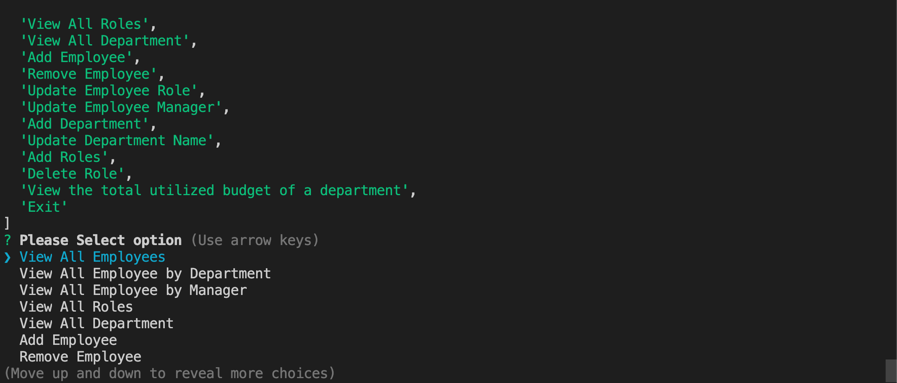
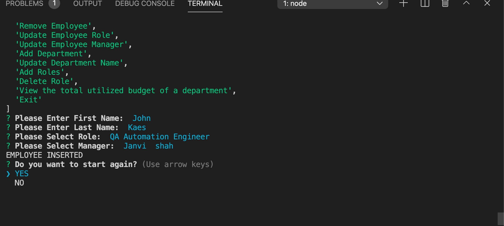
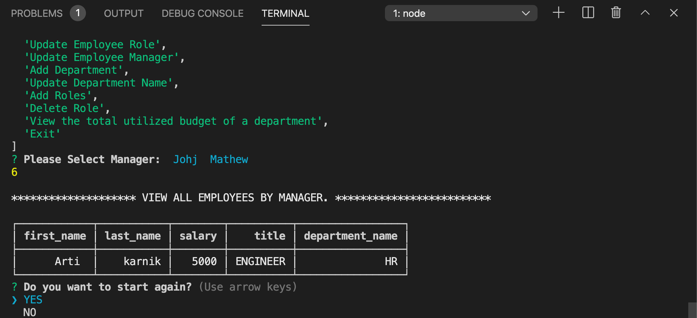

# EmployeeManagement

 [TakeMyNote](#takemynote)
    - [Table of Contents](#table-of-contents)
  * [Summary](#summary)
  * [Description](#description)
  * [Pre-requisite](#pre-requisite)
  * [demo](#demo)
  * [Technologyused:](#technologyused-)
  * [Install:](#install-)
  * [Code snippets:](#code-snippets-)
  * [Testing](#testing)
  * [Contributor](#contributor)
  * [codebase](#codebase)
  * [Application work-through url](#application-work-through-url)

## Summary
CLI application to architect and build a solution for managing a company's employees using node, inquirer, and MySQL.

## Description
Able to view and manage the departments, roles, and employees in a company

## Pre-requisite
Install NodeJS 

## demo

## Technologyused:
<ul>
    <li> 
    <a href="https://developer.mozilla.org/en-US/docs/Web/JavaScript" target="_blank">Javascript <a>
     
    </li>
    <li> 
    <a href="https://nodejs.org/en/docs/" target="_blank">NodeJS <a>
    <li> 
    <a href="https://dev.mysql.com/doc/" target="_blank">mySQL<a>
    </li>
</ul>

## Install:
<strong>Code installation:</strong>  
$ cd [path_to_save_codebase]  
$ git clone https://github.com/arti-karnik/EmployeeManagement  

<strong> Run the application: </strong>  
Open Terminal  
$ npm install  
$ node index.js  

## Code snippets:
Initialize mySQl connection and set up connection.
const mysql = require('mysql');

var connection = mysql.createConnection({
  host: "localhost",
  port: 3306,
  user: 'root',
  password: 'root1234',
  database: 'employeeDb'
});

connection.connect(function(err) {
  if (err) throw err;
});

module.exports = connection;

## Contributor
<strong> Github Profile: </strong>  
https://github.com/arti-karnik

<strong> Portfolio: </strong>  
https://arti-karnik.github.io/MyPortfolioPage/

## codebase
https://github.com/arti-karnik/EmployeeManagement

## Application work-through url
https://drive.google.com/file/d/1nr8CGv9zd1k976X5j-I-FUJ0HYylCc5i/view

Updated Application walk-through : 
https://drive.google.com/file/d/1Vsn0PkM7RM4dj7niywbXbjzd3XcmcVgd/view

